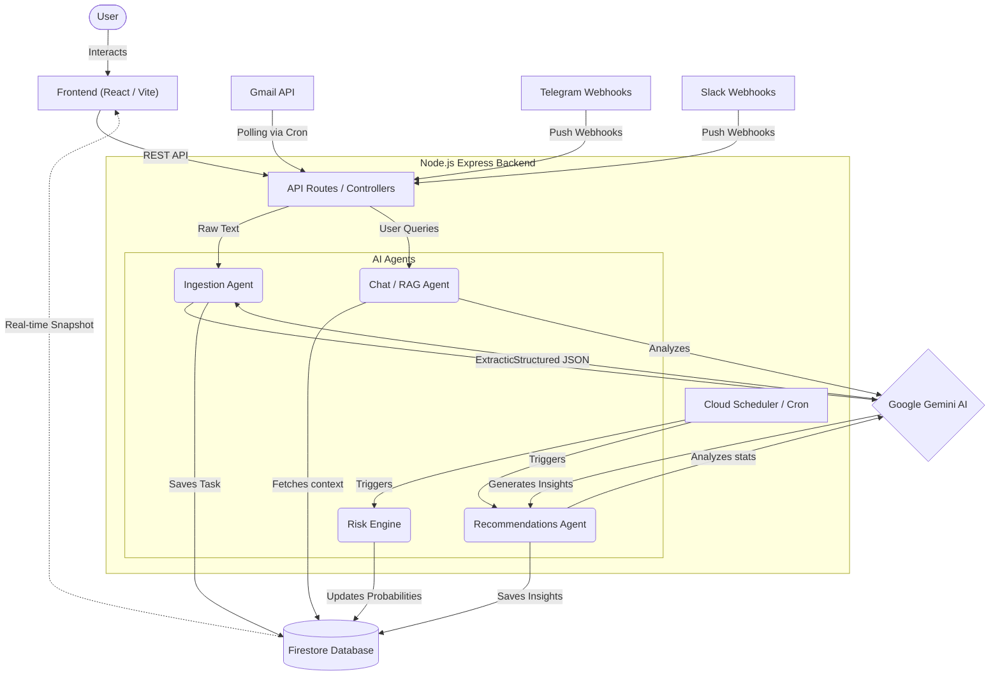

<div align="center">
  
  
  # Niyro
  **Get More Done. Stress Less. Live Better.**
  
  <p align="center">
    Your AI co-pilot that plans your day, manages tasks across all platforms, and saves you from last-minute chaos.
  </p>

  ### 🔗 Important Links
  **[Live Project](https://niyro-e3ddb.web.app)** | **[GitHub Repository](https://github.com/Aniketdhar810/Niyro)**

  **Platform:** Web Application (Responsive Desktop & Mobile)
</div>

---

## 🚀 Problem It Solves

In today's hyper-connected workflow, professionals are drowning in context switching. Deadlines and actionable tasks are scattered across **Gmail, Slack, and Telegram**, leading to overwhelming anxiety and a reactive—rather than proactive—work style. The constant noise makes deep, focused work almost impossible.

Niyro solves this by being a centralized intelligence layer that automatically prioritizes what matters and actively blocks out distractions so you can execute without burning out.

## 💡 Our Solution

**Niyro** is a context-aware AI productivity assistant. It silently ingests tasks from your communication channels, analyzes deadline risks using advanced AI, and organizes your day. Instead of manually tracking what's due, you let Niyro handle the extraction, organization, and reminders. When it's time to work, Niyro's dedicated Focus Mode blocks out the noise so you can execute.

---

## 🌟 How Ingestion Works (User Experience)

The cornerstone of Niyro is its seamless task ingestion. We designed it to be completely frictionless, removing the need for manual data entry.

**The Gmail Ingestion Flow:**
1. **Connect & Forget:** You connect your Google account securely via OAuth in the Niyro dashboard.
2. **The "Niyro" Label:** Once connected, Niyro automatically generates a special label named **`Niyro`** in your Gmail inbox.
3. **Intentional Tagging:** When you receive an email containing actionable items (e.g., a project brief from a client), you simply apply the `Niyro` label to it. You don't have to leave Gmail.
4. **Autonomous Polling:** Every 15 minutes, a Cloud Scheduler cron job quietly polls your inbox for any emails containing the `Niyro` label.
5. **AI Extraction:** Niyro extracts the raw text and sends it to our custom **Ingestion Agent** powered by Gemini. The agent intelligently reads the context, extracts the core task, estimates how long it will take, identifies any hard deadlines, and breaks the task down into smaller actionable steps.
6. **Task Creation & Cleanup:** The parsed task is instantly pushed to your Niyro dashboard via real-time Firestore listeners. Simultaneously, Niyro removes the `Niyro` label from the email in your inbox to ensure it is never processed twice.

*The exact same flow applies to our Slack and Telegram integrations via real-time push Webhooks!*

---

## 🤖 The AI Agents of Niyro

Niyro is powered by a swarm of specialized AI agents working together asynchronously to manage your workflow. 

### 1. 📥 Ingestion Agent
* **What it does:** Reads messy, unstructured text (from emails or chat messages) and synthesizes it into a highly structured JSON Task object with titles, deadlines, steps, and time estimates.
* **When it triggers:** Automatically every 15 minutes (via the Gmail Polling cron job) or instantly when a Slack/Telegram webhook is received.

### 2. ⚠️ Risk Calculation Engine (`riskBatch`)
* **What it does:** Scans your entire database of pending tasks and compares their estimated completion times against their hard deadlines and your available working hours. It assigns a risk level (`on_track`, `at_risk`, `critical`) so you know what is likely to fail before it actually fails.
* **When it triggers:** Automatically runs nightly via Cloud Scheduler, or can be triggered manually by the user for an on-demand recalculation.

### 3. 📈 Recommendations Agent
* **What it does:** Analyzes your historical task completion data, focusing on your "momentum score" and estimation accuracy (how long you thought a task would take vs. how long it actually took). It generates highly personalized, actionable advice on how to improve your workflow.
* **When it triggers:** Automatically runs nightly via Cloud Scheduler, delivering fresh insights to your dashboard every morning.

### 4. 🛠️ Executor Agent
* **What it does:** Acts on your behalf to resolve issues. If a task is critically at risk, the Executor Agent can draft an email to your client negotiating a deadline extension, or ping an accountability partner.
* **When it triggers:** Triggered on-demand when you approve a high-risk action in the dashboard, or through explicit commands in the AI Chat.

### 5. 💬 RAG Chat Agent
* **What it does:** A conversational interface that acts as your personal chief of staff. It uses Retrieval-Augmented Generation (RAG) to search your tasks and database. You can ask it things like *"What's on my plate today?"* or *"Do I have enough time to finish the marketing brief before Friday?"*
* **When it triggers:** Manually, whenever you interact with the Chat interface in the Niyro dashboard.

---

## ✨ Key Features

| Feature | Description |
| :--- | :--- |
| **Multi-Channel Sync** | Auto-extracts tasks from Gmail, Slack, and Telegram directly into your dashboard. |
| **Conversational AI** | Chat interface powered by Google Gemini to query your workload using RAG. |
| **Predictive Risk Engine** | Calculates deadline failure probabilities and assigns visual risk tags. |
| **Focus Mode** | A heavy, brutalist deep-work timer customizable to your preferred duration. |
| **Automated Briefings** | Daily AI-synthesized summaries of your day's priorities, ready for you every morning. |
| **Smart Recommendations** | AI-generated feedback on your work habits, estimation accuracy, and momentum. |

---

## 🏗️ Architecture & Project Structure

Niyro is structured as a modern monorepo, cleanly separating the client interface from the intelligent backend services.

```text
📦 Niyro
 ┣ 📂 frontend               # React, TypeScript, Vite, Tailwind CSS (Brutalist UI)
 ┃ ┣ 📂 src/pages            # Dashboard, Focus Mode, AI Assistant, Settings
 ┃ ┣ 📂 src/components       # Reusable brutalist UI components
 ┃ ┗ 📂 src/hooks            # Firebase real-time state management hooks
 ┃
 ┗ 📂 backend                # Node.js, Express (API & AI Intelligence)
   ┣ 📂 src/agents           # LangChain-style AI agents (Chat, Executor, Ingest)
   ┣ 📂 src/controllers      # Core API logic and Firebase mutations
   ┣ 📂 src/cron             # Cloud Scheduler endpoints (Risk Batch, Polling)
   ┣ 📂 src/lib              # Google Cloud clients (Gemini, Vertex AI)
   ┗ 📂 src/routes           # REST API endpoints & Webhooks
```

### 🗺️ Internal Architecture & Flow Diagram

Here is a visual breakdown of how Niyro's internal modules communicate:



---

## 🛠️ Technologies Used

### Core Stack
- **Frontend:** React, TypeScript, Vite, Tailwind CSS
- **Backend:** Node.js, Express.js
- **Database & Auth:** Firebase Firestore, Firebase Authentication

### Google Cloud Ecosystem
| Technology | Role in Niyro |
| :--- | :--- |
| **Google Gemini API** | Core LLM powering reasoning, chat, extraction, and summarization. |
| **Google Vertex AI** | Text embeddings for the vector search RAG pipeline. |
| **Google Cloud Run** | Serverless, autoscaling hosting for the Express backend. |
| **Firebase Hosting** | High-speed global CDN for the React frontend application. |
| **Google Workspace APIs** | OAuth integration for Gmail extraction and Calendar mutation. |
| **Google Cloud Scheduler** | Reliable trigger execution for automated Polling, Briefings, and Risk engines. |

---

<div align="center">
  <i>Built with ❤️ to end burnout.</i>
</div>
